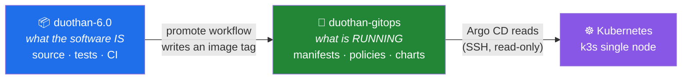
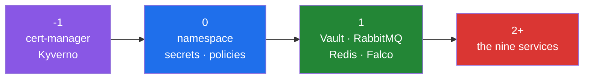
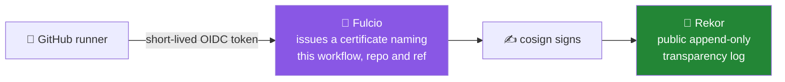

# 🛡️ AEGIS — GitOps & Platform Engineering

**Duothan 6.0 · Phase 01 · Team ScryBug**

> Declarative deployment for the AEGIS resilient digital banking platform.
> Git is the only source of truth. Argo CD continuously compares the cluster
> against this repository and applies **only** what is committed here, so every
> change is reviewable, traceable and reversible.

Application source lives in **[`duothan-6.0`](https://github.com/Danindu05/duothan-6.0)**.
This repository holds only *what runs where*.

---

## 📑 Contents

| | |
|---|---|
| [1. The two repositories](#1--the-two-repositories) | why the split exists |
| [2. Repository layout](#2--repository-layout) | what is where |
| [3. The platform](#3--the-platform) | cluster, ingress, TLS |
| [4. From a push to production](#4--from-a-push-to-production) | the whole automatic path |
| [5. Argo CD](#5--argo-cd) | app-of-apps, sync waves, drift |
| [6. Progressive delivery](#6--progressive-delivery) | canary, blue-green, the gates |
| [7. Supply-chain security](#7--supply-chain-security) | cosign, SBOM, scanning |
| [8. Admission control](#8--admission-control--kyverno) | Kyverno |
| [9. Observability](#9--observability) | metrics, logs, dashboards, alerts |
| [10. Runtime security](#10--runtime-security--falco) | Falco |
| [11. Secrets & Vault](#11--secrets--vault) | how key material is handled |
| [12. First install](#12--first-install) | bootstrapping from nothing |
| [13. Runbook](#13--runbook) | the traps, and what to do |
| [14. Access](#14--access) | URLs and credentials |

---

## 1. 🔀 The two repositories

The split is deliberate and is the core of the GitOps model.



Neither repository can be edited to change the other by accident. The only
automated path between them is one workflow that writes an image tag after a
successful build — **one direction, one purpose**.

🔑 **Two deploy keys, two directions:**

| Key | Held by | Rights |
|---|---|---|
| `argocd-cluster-readonly` | the cluster | 📖 read-only |
| `aegis-ci-promote` | CI only | ✍️ read-write |

The cluster cannot write to the repository that describes it, and CI cannot read
the cluster. A personal access token was deliberately **not** used: it would carry
the whole account's rights everywhere, when what is needed is one job's rights to
one repository.

---

## 2. 🗺️ Repository layout

```
bootstrap/
  root-app.yaml            the one Application applied by hand — everything else follows

apps/                      one Argo CD Application per component, ordered by sync wave
  cert-manager.yaml        TLS certificate issuance          (wave -1)
  admission.yaml           Kyverno engine + its policies     (wave -1 / 0)
  base.yaml                namespace, ingress, analysis templates
  infrastructure.yaml      Vault, RabbitMQ, Redis            (wave 1)
  runtime-security.yaml    Falco + falcosidekick + UI        (wave 1)
  observability.yaml       kube-prometheus-stack             (wave 1)
  logs.yaml                Loki + Grafana Alloy
  identity/account/transaction/payment/lending/platform/fraud/gateway/frontend.yaml

manifests/
  namespace.yaml           namespace with Pod Security Standards
  ingress.yaml             Traefik routes
  redirect-middleware.yaml plain HTTP → the certified hostname
  analysis-template.yaml   the gates a release must pass
  admission/               ClusterPolicies (image signature verification)
  certs/                   Certificate resources
  infrastructure/          Vault, RabbitMQ, Redis
  observability/           ServiceMonitors, PrometheusRules, 3 Grafana dashboards
  falco/                   ingress for the Falco UI
  argocd/                  ingress for Argo CD itself
  services/                one Rollout + Services per service

charts/aegis-service/      a single chart replacing nine near-identical manifests
environments/
  base/                    per-service values
  production/values.yaml   the deployed image tags

scripts/                   secret creation and Vault bootstrap (secrets never committed)
```

---

## 3. 🏗️ The platform

```mermaid
flowchart TB
    subgraph Internet
        U["👤 Customer"]
    end

    subgraph VM["☁️ Azure VM · 20.219.189.234 · k3s"]
        T["🚦 Traefik ingress<br/>TLS via cert-manager"]

        subgraph NS["namespace: aegis"]
            FE["🖥️ frontend<br/>Angular 21"]
            GW["🚪 gateway<br/>YARP"]
            ID["🔑 identity"]
            AC["💰 account"]
            TX["💸 transaction"]
            PY["🧾 payment"]
            LN["🏦 lending"]
            PL["⚙️ platform"]
            FR["🕵️ fraud<br/>FastAPI"]
            V["🔐 Vault"]
            R["⚡ Redis"]
            Q["📨 RabbitMQ"]
        end

        subgraph OBS["namespaces: observability · falco · kyverno · argocd"]
            P["📊 Prometheus"]
            G["📈 Grafana"]
            L["📜 Loki"]
            F["🚨 Falco"]
            K["🛡️ Kyverno"]
            A["🔄 Argo CD"]
        end
    end

    DB[("🐘 Azure PostgreSQL<br/>one database per service")]

    U --> T --> FE
    T --> GW
    GW --> ID & AC & TX & PY & LN & PL
    TX --> FR
    ID & AC & TX & PY & LN & PL --> DB
    ID & AC & TX & PY & LN & PL --> V

    style VM fill:#0d1117,color:#fff
    style DB fill:#336791,color:#fff
```



| | |
|---|---|
| ☸️ **Cluster** | k3s, single node, Azure VM |
| 🚦 **Ingress** | Traefik |
| 🔒 **TLS** | cert-manager + Let's Encrypt, hostnames via `nip.io`, renewal proven |
| 🐘 **Database** | Azure Database for PostgreSQL — external, one database per service |
| 📨 **In-cluster** | Vault, RabbitMQ, Redis |

> 💡 **Why the tuning looks tight.** The platform was first built on a two-core
> node. `DOTNET_gcServer=0` keeps each .NET service near 70 MB instead of ~120 MB,
> which is what let nine services plus a full observability stack fit on one node.

---

## 4. ⚡ From a push to production

> **Nobody presses anything at any point. Every gate can still stop it.**

```mermaid
flowchart TD
    P["👨‍💻 git push → duothan-6.0 main"]

    subgraph GATES["🧪 Quality gates — fail here and nothing is built"]
        G1["backend<br/>build -warnaserror · 24 tests · vulnerable packages"]
        G2["fraud<br/>12 pytest · pip-audit"]
        G3["frontend<br/>ESLint · tsc --noEmit · npm audit"]
        G4["secrets<br/>Gitleaks over full history"]
    end

    subgraph BUILD["🏗️ Build & publish — 9 images in parallel"]
        B1["🐳 push docker.io/danindu05/aegis-*:sha-&lt;commit&gt;"]
        B2["✍️ cosign sign — keyless OIDC → Fulcio → Rekor"]
        B3["🔍 Trivy — fails on fixable HIGH/CRITICAL"]
        B4["📋 Syft SBOM → attached to the image"]
    end

    PR["📤 Promote<br/>verify all 9 images exist, then write the tag here"]
    AR["🔄 Argo CD notices the commit and syncs"]
    KY["🛡️ Kyverno verifies the signature at admission<br/>and rewrites the tag to the verified digest"]
    RO["🚦 Argo Rollouts releases<br/>7 canary · 2 blue-green"]
    FA["🚨 Falco watches what the new containers actually do"]

    P --> GATES --> BUILD --> PR --> AR --> KY --> RO --> FA

    style GATES fill:#3d1d00
    style BUILD fill:#0d2818
    style PR fill:#1c2128
```



### 🏷️ What travels is a commit SHA, never a moving tag

`latest` **cannot** be deployed by Argo CD — it cannot tell one `latest` from
another and so sees no change to make. It cannot be rolled back to, because
yesterday's `latest` no longer exists anywhere. A tag that names a commit makes
the running system answerable to a line of history.

### ⚠️ The promotion workflow has no manual trigger — on purpose

A manual `workflow_dispatch` run has no build behind it: it names whatever commit
is at the head of the branch. That once wrote `sha-edb1b85` — a workflow-only
commit no image had ever been built from — into all nine manifests, and **every
service fell into `ImagePullBackOff` at once.**

The trigger was removed and `docker manifest inspect` verification of all nine
images was added before anything is written. *That is not hypothetical; it
happened.* **Do not add it back.**

---

## 5. 🔄 Argo CD

### App-of-apps

A single root Application points at `apps/`, and every other Application is
declared there. Bootstrapping the whole platform is **one `kubectl apply` of one
file**; everything else follows.

**23 Applications:** the nine services, plus base, infrastructure, cert-manager,
certs, observability, observability-routes, logs, admission, admission-policies,
runtime-security, falco-routes, argocd-ingress, and the root.

### 🌊 Sync waves — ordering is declared, not hoped for



A service never starts against infrastructure that is not ready.

### 🤝 `ignoreDifferences` — three places, three reasons

Argo CD's job is to revert drift. Sometimes what looks like drift is **another
controller doing its own job**, and left alone the two take turns undoing each
other forever.

| Resource | Field | Why it is load-bearing |
|---|---|---|
| `Service` | `spec.selector` | Argo Rollouts writes a pod-template-hash here to steer canary traffic. Reverting it mid-release can point live traffic at the **wrong revision**. |
| `ClusterPolicy` | `spec.rules` | Kyverno expands its own policies after admitting them. The policy is what we wrote; what Kyverno derives is Kyverno's business. |
| Falcosidekick UI secrets | `data` | The chart generates fresh credentials on every render, so every comparison finds a difference that is not one. |

> 🚫 **Removing either of the first two starts a fight where two controllers undo
> each other forever.** They are not cosmetic.

---

## 6. 🚦 Progressive delivery

Both strategies are used, chosen per service **by what failure would look like to
a customer**.

```mermaid
flowchart TB
    subgraph CANARY["🐤 Canary — the 7 backend services"]
        C1["setWeight 50"] --> C2["⏸️ pause 60s<br/>analysis runs here"] --> C3["setWeight 100"] --> C4["⏸️ pause 30s"]
    end

    subgraph BG["🔵🟢 Blue-green — gateway & frontend"]
        B1["new colour comes up<br/>complete, taking no traffic"] --> B2["🧪 pre-promotion analysis<br/>against &lt;service&gt;-preview"] --> B3["⚡ instant switch"] --> B4["old colour lingers 60s"]
    end

    style CANARY fill:#3d2c00
    style BG fill:#00243d
```



**🐤 Canary — money-moving services.** They take a share of live traffic first. A
bad release is seen by a fraction of customers for one analysis window instead of
by all of them at once. Weight is approximated by pod count (there is no service
mesh), so with two replicas the meaningful steps are half and all. **The pauses
are what make it a canary** rather than a rolling update: each is a decision point
where analysis can stop the release.

**🔵🟢 Blue-green — the entry points.** Where a half-migrated state is most visible
to a customer: a page load that hits the old frontend and the new gateway. The new
colour comes up complete beside the old and takes no traffic until it has passed
analysis. `autoPromotionEnabled: true` — the gate was not removed, it was made the
**decider** rather than the adviser.

### 🧪 The two analysis templates

| Template | What it asks | Detail |
|---|---|---|
| **`service-health`** 🔒 | *Is the new revision actually answering?* | 5 checks, 10s apart, `failureLimit: 0`, expects exactly `200`. Once is not evidence — a version that starts, answers, then falls over on its first real request sails through a single probe. `port` is an argument because .NET listens on 8080 and fraud on 8000. |
| **`canary-metrics`** 📊 | *Are customers being hurt?* | `error-rate` < 5% and `latency-p95` < 2s, measured **against the canary revision alone**. A health endpoint answers 200 while a service returns 500 to everything real. |

> 🩹 **A scar worth knowing.** `successCondition: len(result) == 0 || result[0] < 0.05`
> — that first clause treats an empty Prometheus result as a **pass**. Treating
> silence as failure is stricter, sounds better, and **deadlocked the platform
> twice**: no release could complete whenever metrics were unavailable —
> *including the release that would fix the outage.*

```bash
kubectl argo rollouts get rollout identity -n aegis --watch   # follow a release
kubectl argo rollouts promote identity -n aegis               # skip a pause
kubectl argo rollouts abort identity -n aegis                 # stop, hold on stable
kubectl argo rollouts undo identity -n aegis                  # go back a revision
```

---

## 7. ✍️ Supply-chain security



| | |
|---|---|
| ✍️ **Signing** | Sigstore cosign, **keyless**. Nothing long-lived is stored, so there is no signing key to steal, rotate or lose. Rekor is public and append-only, so a signature cannot be issued quietly. |
| 📋 **SBOM** | Syft, SPDX JSON, attached to the image with `cosign attach sbom` — an SBOM that lives only in a CI run expires with the retention period. |
| 🔍 **Scanning** | Trivy, HIGH + CRITICAL, `ignore-unfixed`, `exit-code 1`. **It fails the job.** |
| 🐳 **Registry** | Docker Hub only. GHCR creates packages private (the cluster could not pull them) and its 403s killed three good builds. |

**Verify any image yourself:**

```bash
cosign verify \
  --certificate-identity-regexp 'https://github.com/Danindu05/duothan-6.0/.*' \
  --certificate-oidc-issuer https://token.actions.githubusercontent.com \
  danindu05/aegis-gateway:sha-ec50660
```

---

## 8. 🛡️ Admission control — Kyverno

> Argo CD guarantees that what runs matches what is in the repository. It does
> **not** guarantee that the image the repository names is the one this project
> built. A tag can be repointed, a registry account can be taken — and each
> produces a cluster perfectly in sync with Git **while running somebody else's
> code.**

| Policy | Mode | What it does |
|---|---|---|
| `verify-aegis-images` | 🔴 **Enforce** | Every Pod in `aegis` matching `danindu05/aegis-*` must carry a cosign signature from *this workflow, in this repository, on this branch*. `mutateDigest` + `verifyDigest` rewrite the tag to the digest that was verified. |
| `disallow-latest-tag` | 🟡 Audit | Catches moving tags on anything else. |

The question asked is not *"was this signed"* — anyone can sign anything — but
**"was this signed by that workflow, in that repository, on that branch"**.

Scoped to the `aegis` namespace: infrastructure from public charts is signed by
its own publishers, if at all, so the platform is not taken down to make a point.

---

## 9. 📊 Observability

| | |
|---|---|
| 📈 **Metrics** | kube-prometheus-stack — Prometheus, Alertmanager, Grafana, node-exporter |
| 📜 **Logs** | Loki + Grafana Alloy |
| 🎯 **Scraping** | ServiceMonitors for the .NET services and fraud |
| 🚨 **Alerts** | 5 rules in 2 groups — `aegis.availability`, `aegis.banking` |

### 📊 Three AEGIS dashboards — 34 panels

| Dashboard | Panels | What it shows |
|---|---|---|
| **AEGIS · Platform health** | 11 | service health, request rates, error rates, latency, resources |
| **AEGIS · Banking operations** | 15 | the bank *as a bank* — transfers, volumes, fraud scores and blocks, ledger activity |
| **AEGIS · Releases** | 8 | releases in flight and whether they are going well |

> 💡 A dashboard about **AEGIS**, not a dashboard about Kubernetes that happens to
> have AEGIS running on it. The Releases board is not a control — Argo Rollouts
> already decides for itself. It is *the view of that decision being taken*: two
> revisions serving at once, the analysis running, and the moment the release
> either completes or is abandoned.

> ⚠️ **Two silent failures lived here.** A ServiceMonitor selected on `tier: banking`
> — a label on the *Rollout*, not on the Services — so it matched nothing and
> produced no targets, no error and no metrics. **A selector that matches nothing is
> the quietest possible failure.** And both Alloy and Grafana pointed at a service
> called `loki`; Helm names it after the *release*, so it is `logs-loki`.

---

## 10. 🚨 Runtime security — Falco

> Everything else in this pipeline judges code **before it runs**: tests,
> scanners, signatures, admission policy. All of it is reasoning about an
> artefact. Runtime detection is the only layer that sees **behaviour** — and
> behaviour is where an attack eventually has to show itself.

The adversary in the brief was unknown when it struck, so nothing matching on
signatures could have recognised it. But it still had to *do* recognisable things.

| Rule | Severity | Why |
|---|---|---|
| 🐚 Shell opened in a banking container | ⚠️ WARNING | Nothing in these images needs an interactive shell. *Proven — it caught a real shell during testing.* |
| 🔎 Reconnaissance tooling | ⚠️ WARNING | `nc`, `nmap`, `curl`, `wget`, `ssh`… These images ship no network tooling. |
| 🔑 Credential material read | 🔴 CRITICAL | Reads of the service-account token by anything other than the expected runtimes — the step between a foothold and moving sideways. |
| 🔐 Vault data touched by non-Vault | 🔴 CRITICAL | `/vault/data` holds the platform's key material. |

**Config:** chart 9.1.0 (Falco 0.44), driver `modern_ebpf`, `bufSizePreset: 2`,
JSON output, syscall drop counter on, ServiceMonitor enabled — because *a silent
sensor and a quiet system look identical.*

> 🎯 **One narrow exemption, named rather than hidden.** The Vault unsealer
> legitimately polls the seal status on `127.0.0.1:8200`, and the recon rule
> caught it on the first day — a true positive against our own design. The honest
> response to a correct-but-unwanted detection is to **name the exception**, not
> to widen the rule until it stops firing.

---

## 11. 🔐 Secrets & Vault

**No secret is committed to this repository.** Database credentials and the Vault
AppRole are created directly on the cluster by the bootstrap scripts.

| | |
|---|---|
| 🔒 **Seal** | Shamir, 3-of-5 shares |
| 🎫 **Service auth** | AppRole — a role ID and secret ID, not a static token, so a leaked credential is scoped and revocable |
| 🔑 **Field encryption** | AES-256-GCM, keys from Vault. GCM because it is *authenticated*: a modified ciphertext fails to decrypt rather than decrypting to garbage some code then trusts |

> ⚖️ **A trade recorded rather than hidden.** Vault sealed itself twice (a VM
> resize reboot, and a change to its pod), and each time the whole API went down
> with it. An auto-unseal sidecar now holds three shares in a Kubernetes secret.
> **This defeats the point of Shamir** — no single party should be able to unseal
> alone. It was taken because a cluster that stays down until a human performs a
> key ceremony is not resilient in any sense the brief means. Deleting the
> `aegis-vault-unseal` secret restores the manual ceremony exactly.

> 🚨 **`vault-keys.json` holds all five unseal shares.** It is gitignored and must
> be distributed to custodians and then deleted. Losing those shares means the
> vault cannot be reopened — and with it the encrypted authenticator seeds and
> card numbers.

---

## 12. 🚀 First install

On the cluster host:

```bash
# 1️⃣  Secrets — database connection strings, read from the app repo's .env
./scripts/create-secrets.sh ~/duothan-app/.env

# 2️⃣  Tell Argo CD about this repository
kubectl apply -f bootstrap/root-app.yaml

# 3️⃣  Once Vault's pod is running, initialise it and issue the services' AppRole
./scripts/bootstrap-vault.sh
```

Argo CD takes it from there: it reads `apps/`, creates one Application per
component, and reconciles them in wave order.

Promotion from CI needs the `GITOPS_DEPLOY_KEY` secret on the application
repository — the private half of the `aegis-ci-promote` deploy key. The built-in
`GITHUB_TOKEN` cannot reach across repositories.

---

## 13. 🧯 Runbook

### ⚠️ Things that will bite you

| Trap | What happens | What to do |
|---|---|---|
| 🚫 **Running the promote workflow manually** | Writes an image tag nothing was built from → all nine services `ImagePullBackOff` | Never. The trigger is removed; do not restore it. |
| 🪝 **A Helm chart's `post-upgrade` hook** | Argo runs it as a **PostSync hook on every sync**. If its image cannot be pulled the container stays *Waiting*, never *Failed*, so `backoffLimit` never trips and **the sync never finishes**. | Disable the hook in the chart values. Deleting the Job is not enough — the operation recreates it. |
| 🔤 **A non-ASCII character in an Application's `helm.values`** | The values are stored as one string and compared character by character. A mangled byte from a hand-applied copy can never converge — the root app flaps OutOfSync forever. | Keep values blocks pure ASCII. |
| 📉 **A ServiceMonitor selecting a label nothing carries** | No targets, no error, no metrics — and a metric gate with nothing to judge | Select on what the *Services* carry, not the Rollout |
| 🔍 **Falco UI shows no events** | The UI creates its search index once at boot. If it starts before its Redis, indexing fails and it never retries — `healthz` still returns 200, so probes never restart it | `kubectl delete pod -n falco -l app.kubernetes.io/component=ui` |

### 🔧 Useful commands

```bash
# What is the platform doing right now?
kubectl get applications -n argocd
kubectl get rollouts -n aegis
kubectl get pods -A | grep -v Running

# Why is an application not converging?
kubectl get app <name> -n argocd -o jsonpath='{.status.operationState.phase} {.status.operationState.message}'

# Is Vault sealed? (it listens on HTTP inside the pod)
kubectl exec -n aegis deploy/vault -c vault -- sh -c 'VAULT_ADDR=http://127.0.0.1:8200 vault status'

# What is firing?
kubectl exec -n observability prometheus-observability-kube-prometh-prometheus-0 -c prometheus -- \
  promtool query instant http://localhost:9090 'ALERTS{alertstate="firing"}'
```

> 💡 `Watchdog` fires **always, by design** — it is the dead-man's switch proving
> the alerting pipeline itself works. It is not a fault.

---

## 14. 🔗 Access

| Service | URL |
|---|---|
| 🏦 **The bank** | https://aegis.20.219.189.234.nip.io/ |
| 🔄 **Argo CD** | https://argocd.20.219.189.234.nip.io/ |
| 📈 **Grafana** | https://grafana.20.219.189.234.nip.io/ |
| 📊 **Prometheus** | https://prometheus.20.219.189.234.nip.io/ |
| 🔔 **Alertmanager** | https://alerts.20.219.189.234.nip.io/ |
| 🚨 **Falco UI** | https://falco.20.219.189.234.nip.io/ |
| 🐳 **Images** | `docker.io/danindu05/aegis-<service>` |
| 🌲 **Signatures** | searchable at https://rekor.sigstore.dev |

All over TLS on Let's Encrypt certificates, renewed by cert-manager. Plain HTTP
arrivals are redirected to the certified hostname.

```bash
# Argo CD's initial admin password
kubectl -n argocd get secret argocd-initial-admin-secret \
  -o jsonpath='{.data.password}' | base64 -d

# Rollouts dashboard
kubectl argo rollouts dashboard -n aegis
```

---

<div align="center">

**Team ScryBug** · R.R.G.A.S. Bandara · D. Nanayakkara · K.G.I. Oshadha · D.T.D. Wijerathna

*Every gate can stop a release. Nobody has to start one.*

</div>
